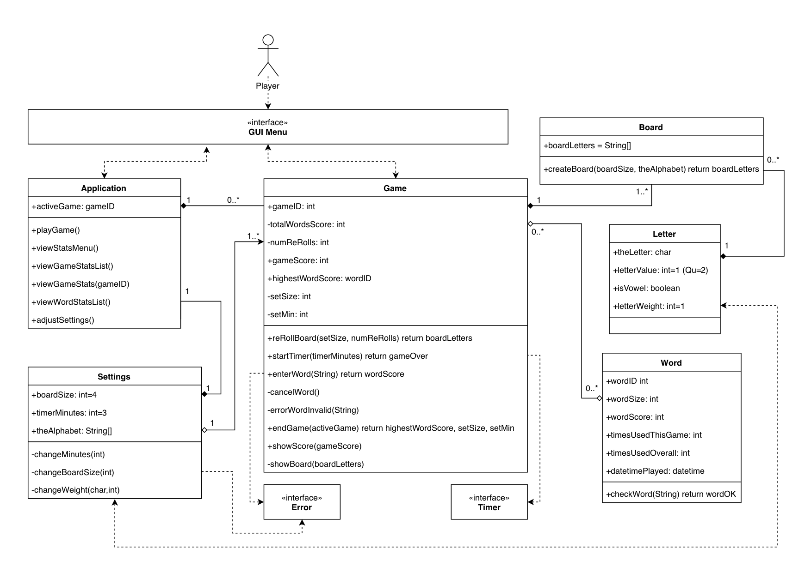
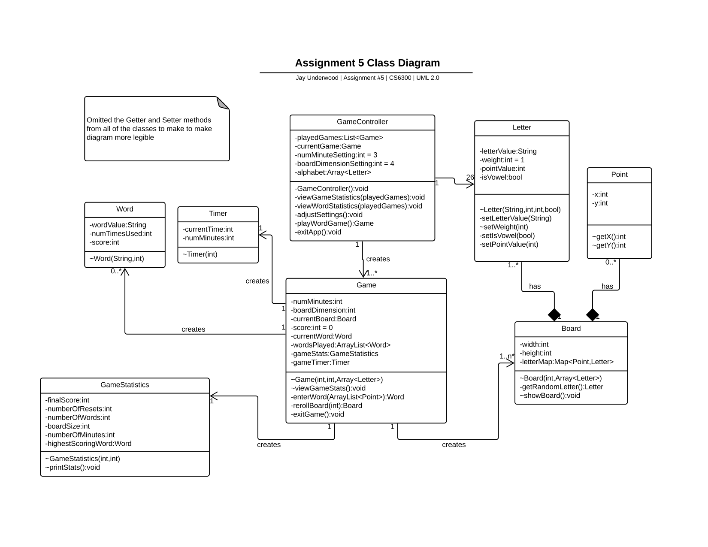
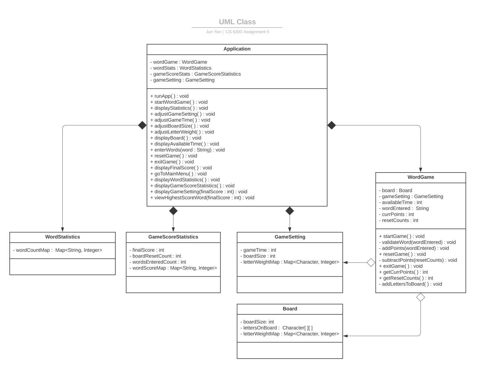
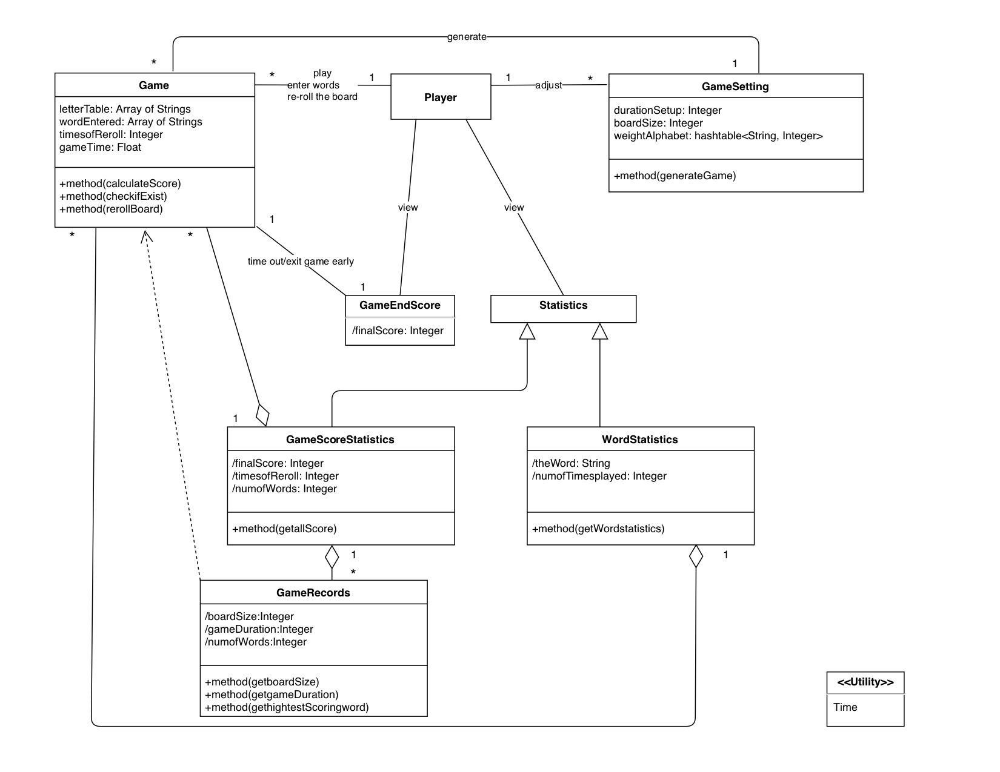
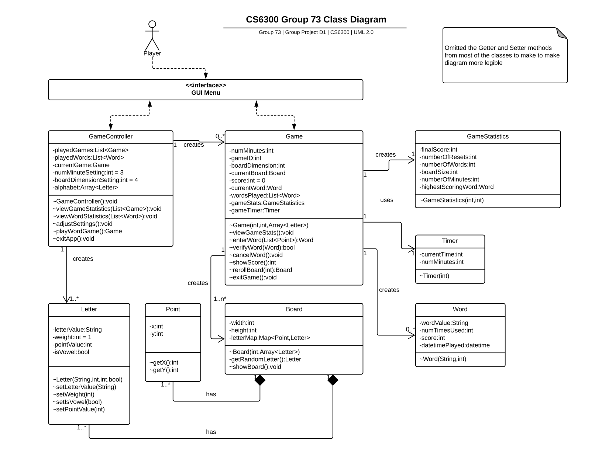

# Team73 Discussion on Designs

## Design 1:

#### Pros:
 * includes interfaces
 * cancelWord() method included
 * dateTime captured for word played for easier sorting later
 * "Database" style design with IDs could make easier for the Statistic presentations later
 * Includes Letter class to track information, some specific requirements about the characters (for example, whether is a vowel or not, etc)
 * Includes distinct checkWord() function inside Word class

#### Cons:
 * 2D array may be too simple or not robust enough for the Alphabet
 * Too many public variables
 * Should the Word class really be a collection of Letter class?
 * Settings class is redundant, can move fields & methods into Application class

----

## Design 2:

#### Pros:
 * Map of the Letters and Points as a design option vs. the 2D array
 * Relationships are well-defined between classes
 * Includes Letter class to track information, some specific requirements about the characters (for example, whether is a vowel or not, etc.)
 * Includes getRandomLetter() function inside Board class

#### Cons:
 * No distinct check word function inside of the enterWord
 * Should the Word class really be a collection of Letter class?

----

## Design 3:

#### Pros:
 * Two types of classes: Control Logic and Data
 * UI only needs to interface with Application class, very simple and easy to work on in a group
 * Simple hash table to track the letter weights

#### Cons:
 * No letter class so can't easily set the letters
 * No separate timer class
 * letterWeightMap might be redundant between Board and Game
 * some of the methods might be redundant as well
 * 2D array of Characters won't work because of the "Qu" special case

----

## Design 4:

#### Pros:

 * Simple hash table to manage the letter weights.
 * Timer is separate as well.
 * GameScoreStatistics and GameRecords are captured
 * Includes a "/" for the implied variables

#### Cons:

 * No letter class makes it difficult to carry information (more than just the letter value) along with each letter (for example, the point values, whether the letter is a vowel or not, etc.).
 * Final score could be an attribute of Game class instead of it's own class "GameEndScore"

----

## Team Design:

#### Commonalities:
* All of us had some form of 'Game' class that included similar fields & methods
* All of us had a similar method for setting/calling settings values for board size and # of minutes
* We all had similar forms of tracking statistics
* Design 1 & 2 were very similar in structure

#### Differences:
* Design 1 used a Settings class that was deemed unnecessary
* Designs 3 did not include a timer class
* Designs 1, 2 & 4 used timers in different ways
* Designs 3 & 4 did not use a Letter class or that was deemed necessary
----
## Summary:
It was interesting to see the different approaches to the problem.  Number 1 and 2 were similar in a lot of aspects, while 3 and 4 had a lot of good ideas on how to approach things.  We incorporate ideas from all 4 members into our final design, while using design #2 as the starting point.

#### GameController class:
The GameController class is essentially the fields and methods needed by the overall application. The GUI interface will interact with the GameController class to implement the three menu options: Play Game, View Stats, or Settings. Here we track the settings for each new game as well as methods for the different menu options.

The GameController class contains variables that represent the current game's settings. The attributes in the Letter class will be passed into the Game class. The adjustSettings() method can change all of these variables.

The viewGameStatistics() method will give us the list of games played and display the variables('finalScore', 'numberOfResets', 'numberOfWords') in the GameStatistics class.

The viewWordStatistics() method will give us the list of words played per game and display the variables('wordValue', 'numTimesUsed') in the Word class.

#### Game class:
This is the heart of where most of the programming will be outside of the GUI.  All game related fields & methods are listed here, which then call on the other methods like Timer, Word, Board, etc.

We can reference a dictionary with the verifyWord() method if needed in the future if requirements change so that a word should only be played once per game (or if a word needs to be checked against a certain language).  This would be a reasonable, common-sense improvement for the gaming experience, so that a player doesn't keep entering the same word over and over (on purpose or by mistake).

#### Letter class:
We decided that a specific Letter class was required to handle the information that needs to be packaged with each letter:
* The letter’s display value (i.e. - Qu special case)
* The letter’s weight (as set in settings, defaulting to 1)
* Whether the letter is a vowel

#### Word class:
We plan to record the datetimePlayed for each verified word that been played. When a user chooses to view the highest scoring word played for a given game, we will know which word was played first when multiple words score an equal number of points.

Score attribute will be calculated from the letter objects which made up the word, instead of counting the length of the string of the word object itself. In this way, we have the freedom over the rules of how to calculate the score out of the letter and word class. The Letter class gives us the freedom to assign the points to each of the individual letters. If the requirements are changed so that a letter's points vary per letter, we can accommodate that easily (ie - Scrabble letters where B=3, K=5, etc...)

#### Point class:
This class will provide coordinates for the letters in a game board. Instead of treating the letters on board as a 2D array, this point class works with the letter class to give us better control over verifying whether the word entered meets the requirement of letter adjacent to each other. When coding, the points will determine where a letter with point values (x, y) is located (ie - Upper left corner vs Lower right corner, etc.)

#### GameStatistics class:
Fields and methods to track the different types of statistics required for each game played.
The method GameStatistics() in GamesStatistics Class will give us the final game score, the number of times the board was reset and the number of words entered in the game.

#### Board class:
The Board class includes the 'letterMap' attribute which maps coordinates (instances of the Point class) and (instances of the Letter class). We think it is better than using a 2D array which may be too simple or not robust enough for the Alphabet.

This class also has attributes width and height. Under the current requirement, both of them are equal boardDimensionSetting. If the requirements changed and the board is no longer a square, we only need to update the width and height attribute of the Board to generate a rectangle board.

The getRandomLetter() method in the Board class will use an algorithm that takes into account the weight of each letter to realize the random selection and allow a letter to appear on the board more than once.

#### Timer class:
This is a utility class that will allow us access to a timer function to track & display how much time is remaining in a game.