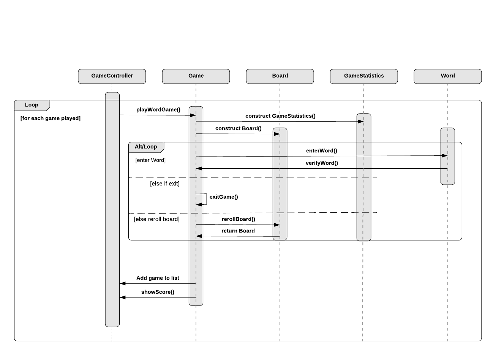

# Design Document

**Author**: 2020 Spring CS6300 Team73

**Date**: 2020.03.03

**Version**: 3.0

| Version | Date    | Comment  | By |
| :----: | :-----------: | :-----------:|:----
| 1.0 | 2/22/20 | Initial document | Jay
| 2.0 | 2/29/20 | Updated diagrams after implementation | Jay
| 3.0 | 3/4/20 | Finalized document | Jay

## 1 Design Considerations

### 1.1 Assumptions

* The application is intended for devices running the Android OS
* The minimum Android version required to run the application is Android 6.0 (Marshmellow)
* The game is designed for a single user
* The game board will be between 4x4 and 8x8 in size, and always square
* The game board letters will be selected based upon letter weight
* Players may enter one unique word per roll of the game board
* The words entered will not be checked against a dictionary
* The game will end when timer reaches 0, or the player selects end game via the GUI interface
* Each time the board is re-rolled, 5 points will be subtracted from the players score
* Negative scores will be allowed
* Game board will consist of 20% vowels and 80% consonants (rounded up)
* Q will be displayed as Qu, and count as 2 points
* Statistics will be sorted in a descending order
* The number of points are not required to be displayed during the game
* The words played are not required to be displayed during the game
* Default settings will be taken from the requirements (timer=3, board size=4, letter weights=1)
* The statistics will be stored between games persistently, even when the user closes the app.

### 1.2 Constraints

* Since there is no external database storing the Game Statistics on a remote server (in the cloud for example), the phone could theoretically be constrained by the storage on the phone, but that limit should be high enough for any practical number of Game Statistics to be stored.

### 1.3 System Environment

* Hardware - Smartphone or Smartphone-like device with at least a 3-inch diagonal touch screen
* Software - Android OS with minimum version 6.0 (Marshmellow)
* Standard Java libraries will be required
* JUnit libraries will be required for testing

## 2 Architectural Design

### 2.1 Component Diagram

The system has several components each of which may encapsulate certain elements of the class structure into three functional areas:

* Game Control/User Interface
  * Containing the Settings and High level game initiation
     * GameController Class
* Game Play
  * Containing the functions needed to play the game
    * Game Class
    * Letter Class
    * Board Class
    * Word Class
* Game Statistics
  * Contains the data recorded for each Game’s stats
    * GameStatistics Class

### 2.2 Deployment Diagram

Because this version of the application doesn’t require persistent storing of data (between runs of the application) the entire application is stored and run directly on the device and doesn’t require a special server or database component.

## 3 Low-Level Design

### 3.1 Class Diagram

### 3.2 Other Diagrams

The sequence diagram below describes a sequence of events only for the playing of the game. The checking of statistics will be handled within the GUI interface.

## 4 User Interface Design

Only the letters that are eligible to select on are showing as blue. The letters need to be adjacent to at least one existing selected letter.
