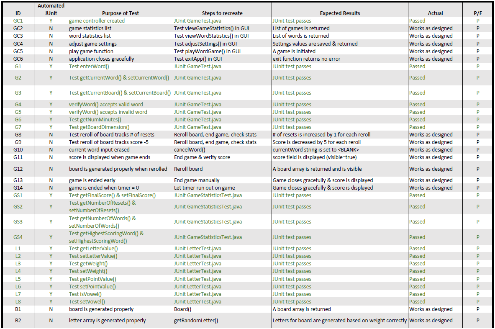
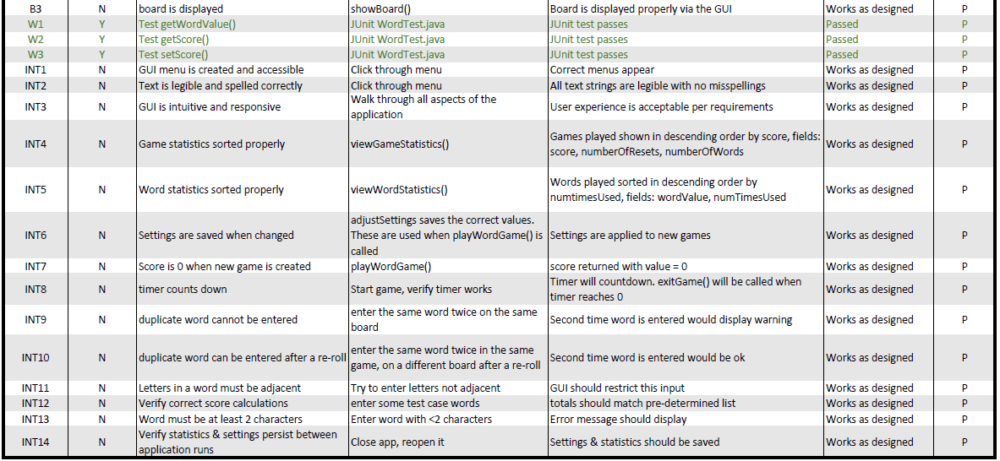

# Test Plan

**Author**: 2020 Spring CS6300 Team73

**Date**: 2020.03.03

**Version**: 3.0

| Version | Date    | Comment  | By |
| :----: | :-----------: | :-----------:|:----
| 1.0 | 2/22/20 | Initial document | Jake
| 2.0 | 2/29/20 | Updated Bug tracking | Jake
| 3.0 | 3/4/20 | Finalized document | Jay 

## 1. Testing Strategy

This document will describe our overall testing strategy while we develop the word game application.

-----

### 1.1 Overall strategy

We plan to incorporate dynamic unit, integration, and regression testing using JUnit. We will also perform manual acceptance testing.  If time allows, we may incorporate Espresso tests as well.

* *Unit*: We will create a unique JUnit test for each class and method we have implemented. By using this method, we can identify portions of the code that need to be debugged.  These will be run throughout development as changes are made to ensure nothing has been broken by a code change.

* *Integration*: A set of test cases will be built for each specified requirement, as well as other basic functional components of the application.

* *Regression*: As we make code modifications and step through versions of the software, regression testing will be run to ensure nothing has been broken.  We don't anticipate too many versions of the software, so these may only be run once or twice. They will be comprised of existing Unit and  Integration tests, and automated as much as possible. All automated tests will be part of our regression testing.

* *Acceptance*: This will be completed by all members of our team.  We will be manually stepping through the application to ensure all errors have been debugged and requirements have been met. These will include things that can’t be quantified, such as readability of letter fonts, etc...

-----

### 1.2 Test Selection

We will be using a combination of white & black box testing cases.  We will use white-box testing for the functions at methods at the unit level.  We will use black-box testing as we expand into Integration testing to verify how different classes work with each other.

Test cases will be determined primarily by their ability to support the requirements given within the assignment.

-----

### 1.3 Adequacy Criterion

We will choose test cases based on the **structural** coverage for unit and integration testing.  As mentioned above, these tests will use white-box testing methods.  Our User Acceptance testing can really be considered a type of overall System testing.  These overall tests will be using black-box testing methods based on **functional** requirements.

-----

### 1.4 Bug Tracking

A tracking log will be kept of all issues.  We will track the following for each bug:
* Issue# for easy reference
* Date found
* Open/Closed
* Short Description
* Owner of the issue

| Issue# | Date Found    | Open/ Closed  | Description | Owner
| :----: | :-----------: | :-----------:| :---------- | :----
| 1 | 2/22/20 | Closed | Board displaying wrong letters | Jay
| 2 | 2/23/20 | Closed | Letter weights not saving | Jun
| 3 | 2/23/20 | Closed | Board not resizing properly | Jay
| 4 | 2/23/20 | Closed | Game stats not sorting correctly | Jun
| 5 | 2/23/20 | Closed | Word stats not sorting correctly | Jun
| 6 | 2/25/20 | Closed | GUI Elements do not display properly on supported phones, required multiple XML | Yang
| 7 | 2/27/20 | Closed | Persistance not yet coded | Jun
| 8 | 2/27/20 | Closed | Word with 0 or 1 character length can be input | Jun
| 9 | 2/27/20 | Closed | Timer should show MIN:SEC not just MIN | Jay
| 10 | 2/28/20 | Closed | App crashes when saving game/settings to local storage | Jun
| 11 | 3/2/20 | Closed | Timer continues to run after quitting game early. Adds 2nd game record to stats | Jun

#### Future feature requests
* Qu letters on the grid do not display in one row when board size is 8
* Seconds under 10 show as:9, :8, :7 instead of :09, :08, :07
* When a large word is entered (> 6 characters) the formatting in the word statistics isn't aesthetically pleasing
* When screen size/resolution is small, the app does not display correctly. 

-----

### 1.5 Technology

We will use JUnit4 to perform automated testing. These 4 files are located under the WordFind6300/app/src/test... folder, they are called:
* GameStatisticsTest.java
* GameTest.java
* LetterTest.java
* WordTest.java

-----

## 2. Test Cases

* **GC** = GameController class
* **G** = Game class
* **GS** = GameStatistics class
* **L** = Letter class
* **B** = Board class
* **W** = Word class
* **INT** = Integration test of multiple classes

