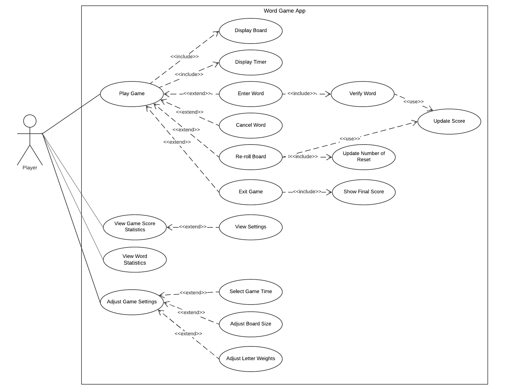

# Use Case Model

**Author**: 2020 Spring CS6300 Team73

**Date**: 2020.03.03

**Version**: 3.0

| Version | Date    | Comment  | By |
| :----: | :-----------: | :-----------:|:----
| 1.0 | 2/22/20 | Initial document | Jun
| 2.0 | 2/29/20 | Updated after complete code | Jun
| 3.0 | 3/4/20 | Finalized document | Jay

## 1 Use Case Diagram

## 2 Use Case Descriptions

##### Use Case: Play Game

- *Requirements: The player can play a word game by selecting the PLAY option from the main menu.*
- *Pre-conditions: The app should be started. The user should select the PLAY option from the main menu.*
- *Post-conditions: The player is redirected to a new page. A word game should be created successfully.*
- *Scenarios:*
  - *Start the app*
  - *Select the PLAY option from the main menu*
  - *The player is redirected to a new page, including below:*
    - *A board with randomly generated letters is shown*
    - *A timer (as set in the settings) is shown, which will count down the number of minutes available for the game*
    - *A word input with a CONFIRM button is shown*
 	- *A RE-ROLL button, a CANCEL button and a QUIT button are shown*

##### Use Case: Display Board

- *Requirements: A board with randomly generated letters should be shown. (This is an included use case of the base use case ‘Play Game’).*
- *Pre-conditions: The app should be started. The user should select the PLAY option from the main menu. The user should be redirected to a new page. A word game should be created successfully.*
- *Post-conditions: A board with randomly generated letters should be shown.*
- *Scenarios:*
  - *Start the app*
  - *Select the PLAY option from the main menu*
  - *The player is redirected to a new page*
  - *A board with randomly generated letters is shown*

##### Use Case: Display Timer
- *Requirements: A board is shown and starts to countdown. (This is an included use case of the base use case ‘Play Game’).*
- *Pre-conditions: The app should be started. The user should select the PLAY option from the main menu. The user should be redirected to a new page. A word game should be created successfully.*
- *Post-conditions: A board is shown and starts to countdown.*
- *Scenarios:*
  - *Start the app*
  - *Select the PLAY option from the main menu*
  - *The player is redirected to a new page*
  - *A timer (as set in the settings) is shown, which will count down the number of minutes available for the game*

##### Use Case: Enter Word

- *Requirements: The player can enter a word during the word game.*
- *Pre-conditions: The app should be started. The user should select the PLAY option from the main menu. The user should be redirected to a new page. A word game should be created successfully. The player should enter a word and click the CONFIRM button.*
- *Post-conditions: The app should validate the entered word.*
- *Scenarios:*
  - *Start the app*
  - *Select the PLAY option from the main menu*
  - *The player is redirected to a new page, including below:*
    - *A board with randomly generated letters is shown*
    - *A timer (as set in the settings) is shown, which will count down the number of minutes available for the game*
    - *A word input with a CONFIRM button is shown*
 	- *A RE-ROLL button, a CANCEL button and a QUIT button are shown*
  - *Enter a word and click CONFIRM button*
  - *The app starts to validate the entered word*

##### Use Case: Verify Word

- *Requirements: After the player entered a word, the app will verify the word.*
- *Pre-conditions: The app should be started. The user should select the PLAY option from the main menu. The user should be redirected to a new page. A word game should be created successfully. The player should enter a word and click the CONFIRM button. The app should validate the entered word.*
- *Post-conditions: If the word is valid: A message is displayed, showing the word is submitted successfully. The score is updated. Else: A warning message is displayed.*
- *Scenarios:*
  - *Start the app*
  - *Select the PLAY option from the main menu*
  - *The player is redirected to a new page, including below:*
    - *A board with randomly generated letters is shown*
    - *A timer (as set in the settings) is shown, which will count down the number of minutes available for the game*
    - *A word input with a CONFIRM button is shown*
 	- *A RE-ROLL button, a CANCEL button and a QUIT button are shown*
  - *Enter a word and click CONFIRM button*
  - *The app starts to validate the entered word*
  - *If the word is valid:*
    - *A message is displayed: Word is submitted successfully!*
    - *The score is updated*
  - *Else:*
    - *A warning message is displayed: Please enter a valid word!*

##### Use Case: Cancel Word

- *Requirements: The player can cancel the word if he/she mistyped the word or does not want to submit it for scoring, by pressing the CANCEL button.*
- *Pre-conditions: The app should be started. The user should select the PLAY option from the main menu. The user should be redirected to a new page. A word game should be created successfully. The player should start to enter a word. The player should click the CANCEL button.*
- *Post-conditions: The word input should be cleared.*
- *Scenarios:*
  - *Start the app*
  - *Select the PLAY option from the main menu*
  - *The player is redirected to a new page, including below:*
    - *A board with randomly generated letters is shown*
    - *A timer (as set in the settings) is shown, which will count down the number of minutes available for the game*
    - *A word input with a CONFIRM button is shown*
 	- *A RE-ROLL button, a CANCEL button and a QUIT button are shown*
  - *Enter a word*
  - *Click the CANCEL button*
  - *The word input is cleared*

##### Use Case: Re-roll Board

- *Requirements: The player can re-roll the board by pressing the RE-ROLL button.*
- *Pre-conditions: The app should be started. The user should select the PLAY option from the main menu. The user should be redirected to a new page. A word game should be created successfully. The player should click the RE-ROLL button.*
- *Post-conditions: The board should be refreshed to reflect the new letters. The number of reset should be updated. The score should be updated.*
- *Scenarios:*
  - *Start the app*
  - *Select the PLAY option from the main menu*
  - *The player is redirected to a new page, including below:*
    - *A board with randomly generated letters is shown*
    - *A timer (as set in the settings) is shown, which will count down the number of minutes available for the game*
    - *A word input with a CONFIRM button is shown*
 	- *A RE-ROLL button, a CANCEL button and a QUIT button are shown*
  - *Click RE-ROLL button to re-roll the board*
  - *The board is refreshed to reflect the new letters*
  - *The number of reset is updated.*
  - *The score is updated*

##### Use Case: Update Number of Reset

- *Requirements: The number of reset is updated after the player pressed RE-ROLL button. (This is an included use case of the base use case ‘Re-roll Board’)*
- *Pre-conditions: The app should be started. The user should select the PLAY option from the main menu. The user should be redirected to a new page. A word game should be created successfully. The player should click the RE-ROLL button.*
- *Post-conditions: The number of reset is updated.*
- *Scenarios:*
  - *Start the app*
  - *Select the PLAY option from the main menu*
  - *The player is redirected to a new page*
  - *Click RE-ROLL button to re-roll the board*
  - *The board is refreshed to reflect the new letters*
  - *The number of reset is updated*

##### Use Case: Exit Game

- *Requirements: The player can exit a word game by pressing the QUIT button.*
- *Pre-conditions: The app should be started. The user should select the PLAY option from the main menu. The user should be redirected to a new page. A word game should be created successfully. The player should click the QUIT button.*
- *Post-conditions: The game should be ended and the final score should be displayed.*
- *Scenarios:*
  - *Start the app*
  - *Select the PLAY option from the main menu*
  - *The player is redirected to a new page, including below:*
    - *A board with randomly generated letters is shown*
    - *A timer (as set in the settings) is shown, which will count down the number of minutes available for the game*
    - *A word input with a CONFIRM button is shown*
 	- *A RE-ROLL button, a CANCEL button and a QUIT button are shown*
  - *Click QUIT button*
  - *The game is ended, the final score is displayed*
  - *Redirect to the main menu*

##### Use Case: Show Final Score

- *Requirements: The app will show the final score if the word game is ended.*
- *Pre-conditions: The app should be started. The user should select the PLAY option from the main menu. The user should be redirected to a new page. A word game should be created successfully. The player should click the QUIT button or the timer is counted down to 0.*
- *Post-conditions: The final score should be displayed.*
- *Scenarios:*
  - *Start the app*
  - *Select the PLAY option from the main menu*
  - *The player is redirected to a new page*
  - *Click the QUIT button or the timer is counted down to 0*
  - *The game is ended, the final score is displayed*

##### Use Case: Update Score

- *Requirements: The app should update the score.(This is a common use case used by ‘Verify Word’ and ‘Re-roll Board’)*
- *Pre-conditions: The app should be started. The user should select the PLAY option from the main menu. The user should be redirected to a new page. A word game should be created successfully. The app should validate the entered word or the board should be re-rolled.*
- *Post-conditions: The score is updated.*
- *Scenarios:*
  - *Start the app*
  - *Select the PLAY option from the main menu*
  - *The player is redirected to a new page, including below:*
    - *A board with randomly generated letters is shown*
    - *A timer (as set in the settings) is shown, which will count down the number of minutes available for the game*
    - *A word input with a CONFIRM button is shown*
 	- *A RE-ROLL button, a CANCEL button and a QUIT button are shown*
  - *The app should validate the entered word or the board should be re-rolled*
  - *The score is updated*

##### Use Case: View Game Score Statistics

- *Requirements: The player can view the Game Score Statistics.*
- *Pre-conditions: The app should be started. The user should select ‘View Game Score Statistics’ option from the main menu.*
- *Post-conditions: Check if results exist. If yes, a list of scores, in descending order by final game score, is shown. If not, a warning message should be displayed.*
- *Scenarios:*
  - *Start the app*
  - *Select ‘View Game Score Statistics’ option from the main menu*
  - *If results found:*
    - *A list of scores, in descending order by final game score, should be shown. (Includes: a. The final game score; b. The number of times the board was reset; c.The number of words entered in the game).*
  - *Else:*
    - *A warning message is displayed: No game score statistics found!*

##### Use Case: View Settings

- *Requirements: The player can select a game score from the score list to view the settings for that game (if multiple words score an equal number of points, the first played will be displayed).*
- *Pre-conditions: The app should be started. The user should select ‘View Game Score Statistics’ option from the main menu. A list of scores, in descending order by final game score, should be shown. The player should select a game score by pressing the button right next to the score.*
- *Post-conditions: The settings for that game’s board size, number of minutes, and the highest scoring word played in the game should be shown.*
- *Scenarios:*
  - *Start the app*
  - *Select ‘View Game Score Statistics’ option from the main menu*
  - *If results found:*
    - *A list of scores, in descending order by final game score, is shown*
    - *Select a game score from the list by pressing the button next to the score*
    - *The settings for that game’s board size, number of minutes, and the highest scoring word played in the game is shown.*
  - *Else:*
    - *A warning message is displayed: No game score statistics found!*

##### Use Case: View Word Statistics

- *Requirements: The player can view the Word Statistics.*
- *Pre-conditions: The app should be started. The user should select ‘View Word Statistics’ option from the main menu.*
- *Post-conditions: Check if results exist. If yes, a list of words used should be shown, starting from the most frequently played. (Includes: a. The word; b. The number of times the word has been played). If not, a warning message should be displayed.*
- *Scenarios:*
  - *Start the app*
  - *Select ‘View Word Statistics’ option from the main menu*
  - *If results found:*
    - *A list of words used should is shown*
  - *Else:*
    - *A warning message is displayed: No word statistics found!*

##### Use Case: Adjust Game Settings

- *Requirements: The player can adjust the game settings.*
- *Pre-conditions: The app should be started. The user should select the SETTINGS option from the main menu.*
- *Post-conditions: The player is redirected to the setting page.*
- *Scenarios:*
  - *Start the app*
  - *Select the SETTINGS option from the main menu*
  - *The player is redirected to the setting page, including three options:*
  	- *Select Game Time*
    - *Adjust Board Size*
    - *Adjust Letter Weights*

##### Use Case: Select Game Time

- *Requirements: The player can select a game time (game to end after a certain number of minutes).*
- *Pre-conditions: The app should be started. The user should select the SETTINGS option from the main menu. The player is redirected to the setting page. The user should click TIME drop-down.*
- *Post-conditions: A drop-down is displayed with the minutes options from 1 to 5, defaulting to 3.*
- *Scenarios:*
  - *Start the app*
  - *Select the SETTINGS option from the main menu*
  - *The player is redirected to the setting page, including three options:*
  	- *Select Game Time*
    - *Adjust Board Size*
    - *Adjust Letter Weights*
  - *Click TIME drop-down.*
  - *A drop-down is displayed with the minutes options from 1 to 5, defaulting to 3*
  - *Select a value from the drop-down and click SAVE button*
  - *Message will be displayed: Set up the game time successfully!*
  - *Go back to the main menu by clicking MAIN button*

##### Use Case: Adjust Board Size

- *Requirements: The player can adjust the board size.*
- *Pre-conditions: The app should be started. The user should select the SETTINGS option from the main menu. The player is redirected to the setting page. The user should click BOARD SIZE drop-down.*
- *Post-conditions: A drop-down is displayed with the size options, between 4(x4) and 8(x8), defaulting to 4.*
- *Scenarios:*
  - *Start the app*
  - *Select the SETTINGS option from the main menu*
  - *The player is redirected to the setting page, including three options:*
  	- *Select Game Time*
    - *Adjust Board Size*
    - *Adjust Letter Weights*
  - *Click BOARD SIZE drop-down.*
  - *A drop-down is displayed with the size options, between 4(x4) and 8(x8), defaulting to 4.*
  - *Select a value from the drop-down and click SAVE button*
  - *Message will be displayed: Set up the board size successfully!*
  - *Go back to the main menu by clicking MAIN button*

##### Use Case: Adjust Letter Weights

- *Requirements: The player can adjust letter weights.*
- *Pre-conditions: The app should be started. The user should select the SETTINGS option from the main menu. The player is redirected to the setting page.*
- *Post-conditions: A board is displayed with the 26 letters and the weight input for each letter.*
- *Scenarios:*
  - *Start the app*
  - *Select the SETTINGS option from the main menu*
  - *The player is redirected to the setting page, including three options:*
  	- *Select Game Time*
    - *Adjust Board Size*
    - *Adjust Letter Weights*
  - *A board is displayed with the 26 letters and the weight input for each letter. The weight value is between 1 and 5, defaulting to 1.*
  - *Adjust the weights for one or multiple letters and click the SAVE button*
  - *Message will be displayed: Set up the letter weights successfully!*
  - *Go back to the main menu by clicking MAIN button*
