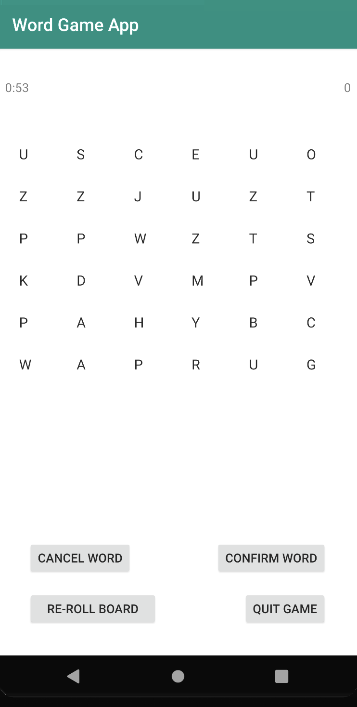

# Android Boggle Game

## Description
Designed and built a boogle game with Java and Android Studio. Persisted users’ historical game statistics and game settings in Android Internal Storage. Implemented layouts that could gracefully respond to different screen sizes and orientations.

## System Requirements

Android OS device with minimum version 6.0 (Marshmellow). Screen size is 3 inch or larger. Phone modle Piex 3 XL (API 23) or above are recommonded.

## Object

To list, within the time limit, as many words of the highest point value as you can find among the random assortment of letters in the cube grid board while keeping the number of re-roll times as low as possible.

## Playing

### Main Menu

From the main menu the user can choose 1. Play  Game 2. Settings 3. Game Statistics 4. Word Statistics

### Setting Adjustment

Before starting the game, you may adjust the settings for the game. Pressing "Settings" on the main page of the application, it would show 3 adjustable settings:

1. Time. Select time in minutes, from 1 to 5. Default 3 minutes
2. Board Size. The size of the cube grid board, from 4 to 8. For example, board size 5 means it is a 5 x 5 board. Default size 4.
3. Letter Weights. The location and particular letters are randomly selected from a distribution fo letters reflecting the weights of letters from this setting. The system will make sure the 1/5 of the letters are vowels (a, e, i, o, u). 4/5 are consonants. Assuming both are consonants or both are vowels, a letter with a weight of 5 would be 5 times as likely to be chosen as a letter with a width of 1. Letter weight can be adjusted for each letter from 1 to 5. Default value 1.

### How to play

Install the boggle_game.apk in your android device. To start the game, press the "Play" button on the main page. The cube grid board would show up, with the timer (upper left corner) and the score (upper right corner). To select letters, taping on the letter on the cube grid board, selected letters will show in the text view below the board.

### Rules

1. Words have to be formed from adjoining letters. Letters must join in the proper sequence to spell a word. They may join horizontally, vertically, or diagonally to the left, right, or up-and-down.
2. No letter cube, however, may be used more than once within a single word.
3. Words must contain at least two letters.

#### Right:

The above 2 examples show how words can be fromed using the adjoining letters.

#### Wrong:

The above 2 examples show 2 incorrect spellings techniques: 1. in "SOILS" the one adjoining "s" is used twice; 2. for form "SOAR" requires skipping over the letter "r", No skipping is allowed letter must adjuoin in sequence.

### Entering words

Use the touch screen to select letter in the proper sequence on the cube grid board. After all the letter of one word been entered,

### Reroll the board

You may reroll the board anything during the game. But it will cost you 5 score points.

### Scores calculation

Scores for a word are calculated every time a word been confirmed and when the board been re-rolled.

The game starts with 0 points. Each word will score 1 point per letter ('Qu' will count as 2 letters), and the cost for each board rest will be subtracted.

For example, one player's record for a game:

1. Entered word "mom" (score +3)
2. Entered word "nice" (score +4)
3. Entered word "Quiet" (score +5)
4. Rerolled board (score -5)
5. Entered word "apple" (score +6)
6. Time up, the game ended

The final score would be the sum of all the scores from the words (3+4+5+6) subtract the reroll board cost (5), which is 13.

### Exit the game

When the timer counts to zero, the game will be ended. But you can always exit the game early by pressing the button "Quit".

### Things to remember

1.  The letter Q would be displayed as 'Qu'.
2.  One word can only be entered one time on the same board during the game.
3. Choose to re-roll the board at a cost of 5 points. The timer will not be reset or paused. The score may go into negative values.

## Records and statistics

There are 2 buttons on the main page for the records and statistics. To view historical records, press the "Records" button; to view word statistics, press the "Word Statistics" button.

### Records

The records will shows list of scores, in descending order by final game score, displaying:

1. The final game score

2. The number of times the board was reset

3. The number of words entered in the game

You may view the detail information of any one of the games in the list, by press on the row of that record. Another view will show you these details for the selected game:

1. The game’s board size

2. Number of minutes

3. Highest scoring word played in the game

### Word Statistics

Word statistics show the list of words used, starting from the most frequently played, displaying:

1. The word
2. The number of times the word has been played, across all games
